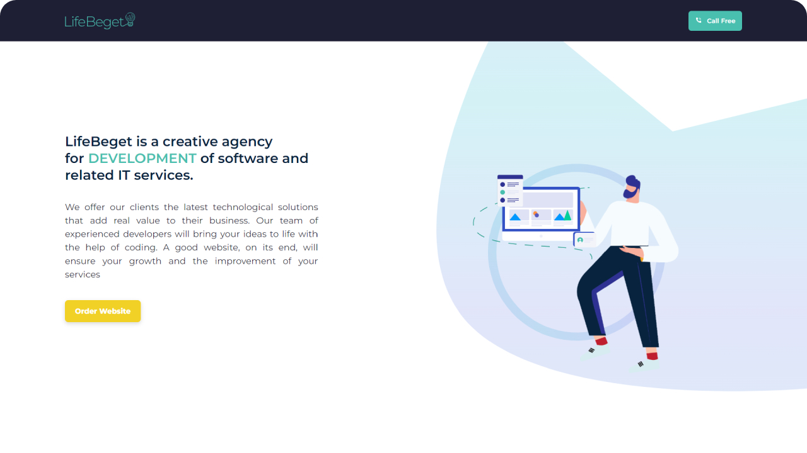

<div align="center">
	
	<h4>#HTML #BEM #CSS #SCSS #JavaScript #EmailJS #Figma</h4>
	
</div>

## 🤖 Introduction
This project is a carefully crafted website created based on a Figma template provided by LifeBeget. It functions as a dynamic landing page with the capability to send real emails to designated company addresses, making it an exceptional platform. During the development process, I encountered challenges, particularly focusing on achieving optimal mobile responsiveness. However, my dedication ensured a seamless and intuitive user experience.

**Figma Design:** [View Here](https://www.figma.com/file/tNscT98nPmE3PORsMUlkh0/LifeBeget?type=design&node-id=0%3A1&mode=design&t=wJYqdKDnybRdReMQ-1)\
**Copyright Notice:** This project is for educational and portfolio demonstration purposes only. Copyright belongs to [LifeBeget.com](https://lifebeget.com/)

## ⚙️ Setup
To view this project locally, follow these steps:
1. Clone this repository.
2. Open the ```index.html``` file in your preferred web browser.

### ⭐ You can check out the project Live [here](https://stepan928.github.io/LifeBeget/).